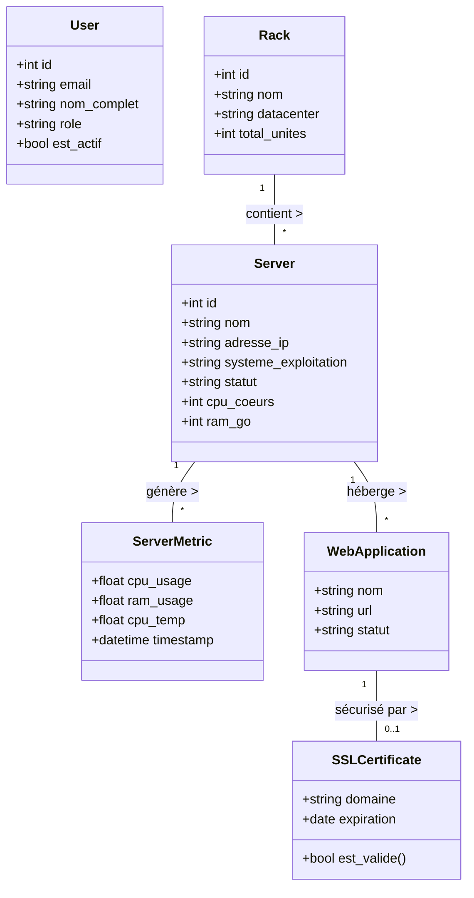
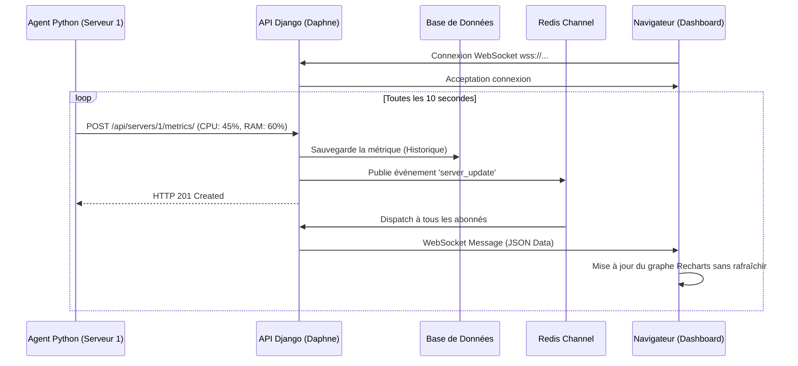

<div align="center">
  
# RÉPUBLIQUE ISLAMIQUE DE MAURITANIE
## Ministère de la Transformation Numérique, de l'Innovation et de la Modernisation de l'Administration (MTNIMA)
### Direction du Développement et de l'Interopérabilité (DDI)

<br/>


*(Insérez le logo MTNIMA fourni ici en le nommant logo_mtnima.png)*

<br/><br/>

# LEBANESE INTERNATIONAL UNIVERSITY (LIU)
**Filière : Informatique Appliquée à la Gestion**

<br/>


*(Insérez le logo LIU fourni ici en le nommant logo_liu.png)*

<br/><br/><br/>

# MÉMOIRE DE PROJET DE FIN D'ÉTUDES
## Pour l'obtention du diplôme de Licence

<br/><br/>

**Sujet :**
# CONCEPTION ET RÉALISATION D'UN SYSTÈME DE GESTION ET DE SUPERVISION DES SERVEURS ET APPLICATIONS (SGSSA)

<br/><br/>

**Présenté par :**  
**Ahmed Taleb Tolba**  
*(Numéro d'étudiant : 12330018)*

<br/><br/>

**Sous l'encadrement de :**  

**Encadrant Académique (LIU) :** Dr Mohamed El Hacen Dyla  
**Encadrant Professionnel (MTNIMA) :** Mr Yaccoub Abdelwedoud  

<br/><br/>

**Année Universitaire : 2025 - 2026**

</div>

\newpage

---

# DÉDICACES

Je dédie ce travail :

À mes très chers parents, pour leur amour inconditionnel, leurs sacrifices, leur soutien moral et matériel tout au long de mes études. Aucune dédicace ne saurait exprimer la profondeur de mon respect et de ma gratitude envers vous.

À ma famille, mes frères et sœurs, pour leurs encouragements constants.

À tous mes amis et collègues de promotion à la Lebanese International University (LIU), avec qui j'ai partagé des moments inoubliables tout au long de mon parcours universitaire.

À tous ceux qui m'ont aidé, de près ou de loin, à réaliser ce modeste travail.

**Ahmed Taleb Tolba**

\newpage

# REMERCIEMENTS

Au terme de ce travail de fin d'études, je tiens à exprimer ma profonde gratitude et mes sincères remerciements à toutes les personnes qui ont contribué de près ou de loin à l'élaboration et à la réussite de ce projet.

Mes remerciements s'adressent en premier lieu à mon encadrant académique, **Dr Mohamed El Hacen Dyla**, pour sa disponibilité, ses conseils judicieux, son encadrement rigoureux et son soutien continu tout au long de la réalisation de ce projet.

Je tiens également à remercier très chaleureusement mon encadrant professionnel, **Mr Yaccoub Abdelwedoud**, au sein du Ministère de la Transformation Numérique, de l'Innovation et de la Modernisation de l'Administration (MTNIMA), pour son accueil, sa confiance, le temps précieux qu'il m'a accordé et son partage d'expertise qui a été déterminant pour le succès de ce projet.

J'exprime ma reconnaissance à l'ensemble du corps professoral de la **Lebanese International University (LIU)** pour la qualité de l'enseignement dispensé durant ma formation en Informatique Appliquée à la Gestion.

Enfin, un grand merci à l'équipe technique de la Direction du Développement et de l'Interopérabilité (DDI) pour leur collaboration et l'environnement de travail stimulant qu'ils ont su créer.

\newpage

# SOMMAIRE

1. INTRODUCTION GÉNÉRALE
2. CHAPITRE 1 : CONTEXTE DU PROJET ET PRÉSENTATION DE L'ORGANISME
3. CHAPITRE 2 : ANALYSE ET SPÉCIFICATION DES BESOINS
4. CHAPITRE 3 : CONCEPTION ET ARCHITECTURE
5. CHAPITRE 4 : RÉALISATION ET OUTILS UTILISÉS
6. CHAPITRE 5 : BILAN, RESTE À FAIRE ET PERSPECTIVES
7. CONCLUSION GÉNÉRALE
8. BIBLIOGRAPHIE ET WEBOGRAPHIE

*(Note: Lors de l'export final sous Word, vous pourrez générer une table des matières automatique)*

\newpage

---

# INTRODUCTION GÉNÉRALE

Dans un monde où la transformation numérique dicte le rythme du développement, les systèmes d'information sont devenus le pilier central des administrations publiques. La République Islamique de Mauritanie, à travers le **Ministère de la Transformation Numérique, de l'Innovation et de la Modernisation de l'Administration (MTNIMA)**, s'est engagée dans une vaste démarche de numérisation de ses services. 

La Direction du Développement et de l'Interopérabilité (DDI), l'entité technique responsable du pilotage de l'infrastructure informatique de l'État mauritanien, gère un parc informatique complexe. Ce parc est composé de nombreux serveurs physiques et virtuels, hébergeant des dizaines d'applications web critiques (portails citoyens, plateformes de gestion interne) réparties dans plusieurs datacenters.

Malgré l'évolution rapide de ces infrastructures, un défi majeur s'est présenté : la supervision et la gestion de ces équipements se faisaient souvent de manière manuelle ou via des outils fragmentés. Cette situation posait des risques de sécurité et de disponibilité des services (pannes non détectées rapidement, certificats SSL expirant sans avertissement, perte de trace des licences logicielles).

C'est dans ce contexte que s'inscrit mon projet de fin d'études, intitulé **Système de Gestion et de Supervision des Serveurs et Applications (SGSSA)**. L'objectif principal de ce projet est de concevoir et de réaliser une plateforme logicielle centralisée, moderne et sécurisée, permettant à la DDI de superviser en temps réel l'ensemble de ses serveurs, d'automatiser les alertes et de rationaliser la gestion des ressources matérielles et logicielles.

Ce mémoire retrace les différentes étapes de conception et de développement de cette solution. Il s'articule autour de cinq chapitres :
- Le **premier chapitre** présente le cadre général du projet et l'organisme d'accueil.
- Le **deuxième chapitre** détaille l'analyse et la spécification des besoins de la DDI.
- Le **troisième chapitre** est consacré à la conception de la solution (diagrammes UML, architecture).
- Le **quatrième chapitre** met en évidence la phase de réalisation technique, les outils et langages utilisés, ainsi que la présentation des interfaces (captures d'écran).
- Le **cinquième chapitre** dresse le bilan du projet, recense les fonctionnalités terminées, celles en cours, et aborde les perspectives d'évolution.

---

\newpage

# CHAPITRE 1 : CONTEXTE DU PROJET ET PRÉSENTATION DE L'ORGANISME

## 1.1 Présentation de l'Organisme d'Accueil (MTNIMA)
Le **Ministère de la Transformation Numérique, de l'Innovation et de la Modernisation de l'Administration (MTNIMA)** est le département gouvernemental mauritanien chargé de la conception, de la mise en œuvre et du suivi de la politique de l'État en matière de technologies de l'information et de la communication. 

### 1.1.1 La Direction du Développement et de l'Interopérabilité (DDI)
Au sein du MTNIMA, la **DDI** a pour mission de :
- Concevoir et déployer les applications gouvernementales.
- Assurer l'hébergement et la disponibilité des plateformes numériques de l'État.
- Veiller à la sécurité et à la supervision des serveurs.
- Assurer l'interopérabilité entre les différents systèmes d'information des ministères.

## 1.2 Problématique
Pour accomplir sa mission, la DDI s'appuie sur une infrastructure technologique imposante. Cependant, la croissance exponentielle du nombre de serveurs et d'applications a révélé plusieurs dysfonctionnements dans la gestion quotidienne :
1. **Éparpillement de l'information** : Les données concernant les serveurs (adresse IP, localisation dans les racks, RAM, CPU) étaient conservées dans des fichiers tableurs (Excel) peu sécurisés et difficiles à maintenir à jour.
2. **Supervision réactive plutôt que proactive** : L'équipe technique était souvent alertée d'une panne par les utilisateurs finaux, par manque d'un système de surveillance en temps réel.
3. **Gestion des Certificats SSL** : Les certificats de sécurité expirant de manière inattendue causaient des interruptions de services web critiques, ternissant l'image de l'administration.
4. **Sécurité et Traçabilité** : L'absence d'un outil centralisé avec une gestion fine des droits d'accès (RBAC) compliquait l'audit des actions effectuées par les différents techniciens.

## 1.3 Objectifs du Projet SGSSA
Face à ces défis, le projet **SGSSA (Système de Gestion et de Supervision des Serveurs et Applications)** a été initié pour apporter une solution logicielle sur mesure. Les objectifs sont multiples :
- **Centralisation** : Regrouper toutes les informations matérielles (Racks, Serveurs) et logicielles (Applications, Licences) sur une interface web unique.
- **Monitoring en Temps Réel** : Remonter les métriques de performance (CPU, RAM, Disque, Température) toutes les quelques secondes.
- **Alertes Proactives** : Mettre en place un mécanisme d'alerte pour les certificats SSL expirant dans moins de 30 jours, ainsi que pour la perte de connexion avec un serveur.
- **Sécurité et Contrôle** : Assurer une authentification robuste (JWT) et maintenir un journal d'audit complet de toutes les opérations.

---

\newpage

# CHAPITRE 2 : ANALYSE ET SPÉCIFICATION DES BESOINS

La réussite d'un projet informatique repose sur une compréhension claire et précise des attentes des utilisateurs. Cette phase d'analyse permet de définir les besoins fonctionnels et non-fonctionnels du SGSSA.

## 2.1 Les Acteurs du Système
L'application doit supporter une hiérarchie stricte des rôles pour garantir la sécurité. Quatre acteurs principaux ont été identifiés :
1. **Administrateur Système** : Accès total au système, gestion des utilisateurs, rôles et configurations globales.
2. **Superviseur** : Rôle axé sur la surveillance. Il consulte les tableaux de bord, gère les alertes et modifie les statuts, mais ne supprime pas de serveurs.
3. **Technicien** : Rôle opérationnel. Il peut ajouter, modifier ou supprimer des serveurs, des logiciels et des applications web, et rattacher des certificats SSL.
4. **Lecteur** : Accès en lecture seule. Destiné aux cadres ou directeurs souhaitant avoir une vue globale (Dashboard) sans risque de modification des données.

## 2.2 Besoins Fonctionnels
Les besoins fonctionnels décrivent les actions exactes que le système doit permettre d'effectuer.

- **Gestion du Parc Matériel** : 
  - Gérer les DataCenters et les Racks.
  - Gérer les serveurs (physiques et virtuels), avec leurs caractéristiques (IP, OS, Cores CPU, RAM).
- **Gestion du Parc Logiciel** :
  - Inventorier les logiciels installés sur chaque serveur avec leurs numéros de version.
  - Gérer les applications web hébergées, leurs URLs et leurs ports.
- **Gestion des Certificats SSL** :
  - Ajouter des certificats, relier au domaine correspondant.
  - Calculer automatiquement le nombre de jours avant expiration et générer un statut (Valide, Attention, Critique, Expiré).
- **Supervision (Monitoring)** :
  - Afficher l'état en temps réel d'un serveur (En ligne, Hors ligne).
  - Collecter et afficher sous forme de graphiques les métriques dynamiques (CPU %, RAM %, etc.).
  - Gérer un flux d'images (captures d'écran ou photos des racks) téléchargées régulièrement.
- **Administration** :
  - Authentification sécurisée.
  - Journalisation (Audit Log) de chaque création, modification ou suppression dans le système avec la date, l'auteur et l'action.

## 2.3 Besoins Non-Fonctionnels
Ces besoins concernent la qualité de la solution, ses performances et sa sécurité :
- **Performance** : L'interface web doit être réactive, notamment le Dashboard qui doit se mettre à jour instantanément via des WebSockets sans rechargement de la page.
- **Sécurité** : Protection par token JWT (JSON Web Token). Mot de passe crypté. 
- **Fiabilité** : Le backend doit pouvoir supporter de nombreuses requêtes simultanées provenant des agents installés sur les serveurs.
- **Ergonomie** : L'interface (UI) doit être intuitive, proposer un mode sombre (Dark Mode) apprécié par les administrateurs systèmes, et être responsive (adaptable sur tablette/mobile).

## 2.4 Diagramme des Cas d'Utilisation (Use Cases)
Le diagramme des cas d'utilisation modélise les interactions entre les acteurs et le système.

```mermaid
usecaseDiagram
    actor "Administrateur" as Admin
    actor "Technicien" as Tech
    actor "Superviseur" as Sup
    actor "Lecteur" as Lec

    usecase "Consulter Dashboard" as UC1
    usecase "Gérer Serveurs/Racks" as UC2
    usecase "Gérer Utilisateurs" as UC3
    usecase "Gérer Alertes SSL" as UC4
    usecase "Consulter Logs Audit" as UC5

    Lec --> UC1
    Sup --> UC1
    Sup --> UC4
    
    Tech --> UC1
    Tech --> UC2
    Tech --> UC4
    
    Admin --> UC1
    Admin --> UC2
    Admin --> UC3
    Admin --> UC4
    Admin --> UC5
```

*Figure 1: Diagramme des Cas d'Utilisation principal du système SGSSA.*

---

\newpage

# CHAPITRE 3 : CONCEPTION ET ARCHITECTURE

La conception est l'étape charnière entre l'analyse des besoins et l'implémentation. Elle permet de définir la structure interne de l'application et la logique des données.

## 3.1 Architecture du Système
L'application a été conçue selon une architecture **Client-Serveur découplée**, idéale pour la scalabilité et la maintenance.

1. **La couche Client (Frontend)** : Elle est développée avec le framework Next.js. Elle est responsable de l'affichage des données à l'utilisateur et de la communication avec l'API.
2. **La couche Serveur (Backend API)** : Elle est développée en Python avec le framework Django et Django REST Framework. Elle expose des points d'accès (Endpoints REST) et des WebSockets pour le temps réel.
3. **La couche Collecteur (Agent)** : Un petit script Python (`sgssa_agent.py`) exécuté sur chaque serveur cible, qui lit les données systèmes locales (via la bibliothèque `psutil`) et les envoie au Backend via une API POST.
4. **La couche Données** : Une base de données relationnelle (PostgreSQL/SQLite) pour le stockage persistant, et un serveur Redis pour gérer la messagerie rapide des WebSockets (Channel Layer).

## 3.2 Diagramme de Classes (UML)
Le diagramme de classes représente la structure statique du système et de la base de données.


*Figure 2: Diagramme de Classes modélisant les entités métiers.*

## 3.3 Diagramme de Séquence : Monitoring Temps Réel
Ce diagramme explique la cinématique de mise à jour du Dashboard de manière asynchrone (WebSocket) lorsqu'un serveur envoie ses performances.


*Figure 3: Diagramme de Séquence du flux de monitoring temps réel.*

---

\newpage

# CHAPITRE 4 : RÉALISATION ET OUTILS UTILISÉS

Dans cette phase, nous abordons la traduction de la conception en code source fonctionnel, en détaillant l'environnement matériel et logiciel utilisé.

## 4.1 Outils et Technologies (Stack Technique)

Afin de garantir la performance, la sécurité et l'évolutivité de SGSSA, une stack technologique moderne a été sélectionnée.

### 4.1.1 Côté Backend (Le Serveur)
- **Langage** : Python 3.13, reconnu pour sa robustesse et ses bibliothèques d'administration système.
- **Framework** : **Django 4.x**, couplé à **Django REST Framework (DRF)**. Django offre un ORM puissant et un panneau d'administration natif, tandis que DRF permet de construire une API REST professionnelle rapidement.
- **Temps Réel** : **Django Channels** et le serveur ASGI **Daphne**. Ils permettent de gérer les connexions asynchrones WebSockets.
- **Base de données** : **SQLite** pour l'environnement de développement, avec une compatibilité totale vers **PostgreSQL** pour la production.
- **Message Broker** : **Redis** est utilisé comme "Channel Layer" pour distribuer les messages WebSockets entre le backend et les multiples clients connectés.

### 4.1.2 Côté Frontend (L'Interface Utilisateur)
- **Framework** : **Next.js 14 (App Router)** basé sur React. Il permet un rendu hybride (SSR/CSR) offrant d'excellentes performances.
- **Langage** : **TypeScript**, qui ajoute un typage statique à JavaScript, réduisant drastiquement les erreurs (bugs) durant le développement.
- **Stylisation** : **Tailwind CSS**, un framework CSS utilitaire permettant de créer un design sur mesure et un *Dark Mode* d'apparence très professionnelle.
- **Bibliothèques annexes** : **Recharts** pour le dessin des graphiques statistiques (CPU, RAM), **Lucide-React** pour l'iconographie, et **React Hot Toast** pour les notifications visuelles.

### 4.1.3 Outils de Déploiement et de Versioning
- **Git & GitHub** : Pour la gestion du code source et l'historique des modifications.
- **Docker & Docker Compose** : Pour la conteneurisation de l'application. Le projet peut être déployé en un seul bloc (Backend, Frontend, Redis) via la commande `docker-compose up`, évitant ainsi le fameux problème du "ça marche sur ma machine mais pas sur le serveur".
- **Nginx** : Utilisé comme proxy inverse (Reverse Proxy) pour router le trafic et gérer les certificats SSL du serveur principal.

## 4.2 Implémentation de la Base de Données
Le mapping objet-relationnel (ORM) de Django a été utilisé pour générer les tables. Par exemple, la définition du modèle de Certificat SSL :

```python
from django.db import models
from django.utils import timezone

class SSLCertificate(models.Model):
    web_app = models.OneToOneField('webapps.WebApp', on_delete=models.CASCADE, related_name='ssl_certificate')
    domain_name = models.CharField(max_length=255)
    issuer = models.CharField(max_length=255)
    valid_from = models.DateField()
    valid_until = models.DateField()
    
    @property
    def days_until_expiry(self):
        delta = self.valid_until - timezone.now().date()
        return delta.days
```
Ce code permet de calculer dynamiquement le nombre de jours restants avant expiration, facilitant le système d'alerte.

## 4.3 Présentation des Interfaces (Shortcuts du Projet)

*(Note pour la version finale : Remplacez les espaces ci-dessous par de vraies captures d'écran de votre application).*

### 4.3.1 Interface d'Authentification
La sécurité du système débute par une page de connexion stricte protégeant l'accès au SGSSA. Le système utilise des JSON Web Tokens (JWT) pour maintenir la session active de manière sécurisée.


*(Insérer Capture d'écran de la page de Login)*

### 4.3.2 Le Tableau de Bord (Dashboard)
Le tableau de bord est le cœur visuel de l'application. Il offre une vue synthétique :
- Nombre total de serveurs, racks, et applications.
- Des cartes cliquables pour une navigation rapide.
- Un panneau d'alertes listant instantanément les serveurs hors-ligne et les certificats expirant.
- Les graphiques d'évolution des performances.


*(Insérer Capture d'écran du Dashboard Général)*

### 4.3.3 Gestion des Serveurs et Monitoring
Dans cette interface, le technicien peut voir la liste complète des serveurs filtrée par datacenter. En cliquant sur un serveur, il accède à sa fiche technique (IP, OS, Rack assigné) et aux jauges (Gauges) circulaires indiquant l'usage exact du CPU et de la RAM en temps réel.


*(Insérer Capture d'écran de la page des serveurs et détails monitoring)*

### 4.3.4 Inventaire Logiciel et Certificats SSL
Une page dédiée liste tous les logiciels installés et les certificats SSL. Pour les certificats, un code couleur est appliqué (Vert > 30 jours, Orange < 30 jours, Rouge < 7 jours).


*(Insérer Capture d'écran du module Certificats SSL)*

---

\newpage

# CHAPITRE 5 : BILAN, RESTE À FAIRE ET PERSPECTIVES

Au cours de la réalisation de ce mémoire de fin d'études, la majorité des objectifs fixés au départ ont été atteints, livrant à la DDI-MTNIMA une plateforme fonctionnelle.

## 5.1 Bilan et Fonctionnalités Réalisées (Ce qui a été fait)

Le système SGSSA est aujourd'hui capable de prendre en charge le flux de travail d'un administrateur système. Les modules entièrement terminés, testés et opérationnels sont :

1. **L'architecture Back-end / Front-end** : Complètement structurée et déployée via Docker.
2. **Le système d'Authentification (RBAC)** : Les rôles sont respectés (un lecteur ne peut pas effacer un serveur). Les JWT sont opérationnels.
3. **Le CRUD (Create, Read, Update, Delete)** de toutes les entités : Racks, Serveurs, Logiciels, WebApps, et Certificats.
4. **Le Monitoring Temps Réel** : L'implémentation des WebSockets via Django Channels et Daphne est un grand succès. Les graphiques du frontend s'animent en temps réel sans rechargement de la page dès qu'un agent distant envoie une donnée.
5. **Le Système d'Alerte Visuelle** : Détection des serveurs en perte de ping (Heartbeat timeout) et des certificats SSL proches de l'expiration.
6. **Le Journal d'Audit (Audit Log)** : Chaque action sensible est enregistrée dans une table de l'historique garantissant la traçabilité.

## 5.2 Reste à Faire (En cours de développement)

Bien que l'application soit fonctionnelle, certaines fonctionnalités initialement prévues ont dû être reportées en raison des contraintes de temps liées à la durée du stage et au périmètre de la licence :

1. **Agent Python sur Linux/Windows réels** : Le script de l'agent a été développé et testé en local, mais son déploiement massif de manière automatisée (via Ansible par exemple) sur les dizaines de serveurs réels de la DDI reste à faire.
2. **Alertes par Email / SMS** : Actuellement, les alertes sont uniquement visuelles sur le Dashboard. L'intégration d'un serveur SMTP pour envoyer un e-mail à l'administrateur lorsqu'un serveur tombe en panne est en cours de configuration.
3. **Export PDF des Rapports** : La possibilité de générer et télécharger un inventaire complet en format PDF ou Excel depuis l'interface web.

## 5.3 Perspectives et Améliorations Futures

SGSSA a été pensé comme un socle évolutif. Dans le futur, plusieurs évolutions majeures pourraient être apportées au projet :

- **Intégration Active Directory / LDAP** : Au lieu de gérer les utilisateurs dans la base de données interne de l'application, l'authentification pourrait se greffer sur l'annuaire gouvernemental existant pour implémenter un SSO (Single Sign-On).
- **Application Mobile Native** : Développer une version mobile (en React Native) pour permettre aux administrateurs de recevoir des notifications Push directement sur leur smartphone, même hors des locaux de la DDI.
- **Machine Learning (IA) pour l'Analyse Prédictive** : Analyser les données historiques d'utilisation du CPU et de la RAM pour prédire les pannes ou recommander l'achat de serveurs supplémentaires avant la saturation d'un Datacenter.
- **Backup Automatisé** : Ajouter un module au SGSSA permettant de planifier et lancer la sauvegarde des bases de données des serveurs distants.

---

\newpage

# CONCLUSION GÉNÉRALE

Ce projet de fin d'études a consisté à concevoir, développer et déployer un **Système de Gestion et de Supervision des Serveurs et Applications (SGSSA)** au profit de la Direction du Développement et de l'Interopérabilité (DDI) du Ministère de la Transformation Numérique (MTNIMA).

Face aux défis d'une infrastructure IT fragmentée et difficile à superviser, le SGSSA apporte une réponse logicielle moderne, centralisée et hautement réactive. La solution permet non seulement d'inventorier avec précision le parc matériel et logiciel, mais offre surtout une capacité de surveillance en temps réel indispensable au maintien des services gouvernementaux. Les risques liés à l'expiration des certificats SSL ou aux pannes serveurs silencieuses sont désormais fortement atténués grâce aux alertes préventives.

Sur le plan technique et personnel, ce projet s'est révélé extrêmement formateur. Il m'a permis de mettre en pratique et d'approfondir les connaissances théoriques acquises durant ma formation à la **Lebanese International University (LIU)**. La réalisation de cette plateforme Full-Stack m'a confronté aux réalités du métier de développeur et d'administrateur système :
- La conception architecturale avec UML.
- La maîtrise de frameworks modernes très demandés sur le marché (Django, Next.js, Tailwind CSS).
- La complexité de la communication en temps réel (WebSockets, Redis).
- Les enjeux du déploiement via la conteneurisation Docker.

En définitive, SGSSA n'est pas seulement un projet académique, mais un véritable outil prêt pour la production qui s'inscrit pleinement dans la dynamique de modernisation de l'administration portée par le MTNIMA. Je suis fier de l'impact potentiel de ce travail et convaincu qu'il constitue un tremplin solide pour ma future carrière d'ingénieur informaticien.

\newpage

# BIBLIOGRAPHIE ET WEBOGRAPHIE

**Bibliographie :**
1. Roques, P. (2018). *UML 2.5 par la pratique : Études de cas et exercices corrigés*. Eyrolles.
2. Vincent, M. (2021). *Apprendre la programmation orientée objet avec Python*. Dunod.

**Webographie :**
1. **Django Software Foundation**. Documentation officielle de Django (Version 4.2). Disponible sur : [https://docs.djangoproject.com/](https://docs.djangoproject.com/) (Consulté en 2026).
2. **Next.js**. Documentation officielle de Next.js (App Router). Disponible sur : [https://nextjs.org/docs](https://nextjs.org/docs) (Consulté en 2026).
3. **Django REST Framework**. DRF Documentation. Disponible sur : [https://www.django-rest-framework.org/](https://www.django-rest-framework.org/) (Consulté en 2026).
4. **Tailwind CSS**. Documentation officielle. Disponible sur : [https://tailwindcss.com/](https://tailwindcss.com/) (Consulté en 2026).
5. **Docker**. Documentation technique. Disponible sur : [https://docs.docker.com/](https://docs.docker.com/) (Consulté en 2026).
6. Stack Overflow & Communautés GitHub pour la résolution de bugs spécifiques liés aux WebSockets.
