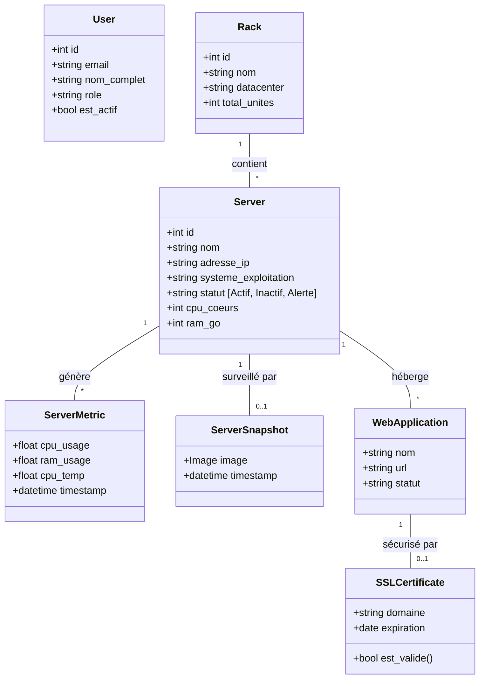
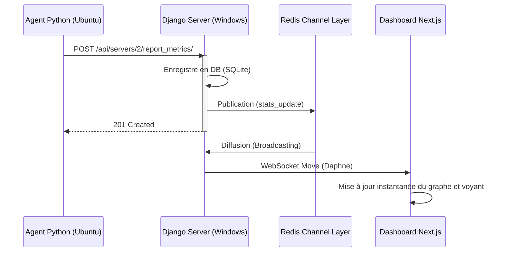

# Rapport de Projet : SGSSA
## Système de Gestion et de Supervision des Serveurs et Applications

**Auteur** : Ahmed Taleb Tolba  
**Organisation** : DDI-MTNIMA  
**Date** : 14 Avril 2026

---

## 1. Présentation du Projet
Le projet **SGSSA** est une plateforme full-stack conçue pour la surveillance centralisée, l'administration et la gestion de l'infrastructure informatique (serveurs, racks, applications web, logiciels et certificats SSL). Il permet un monitoring en temps réel des performances et une surveillance visuelle via caméra.

---

## 2. Architecture Technique
Le système repose sur une architecture répartie en trois couches principales :

1.  **Backend (Cœur du système)** : Développé avec **Django**, il gère l'API REST (via DRF) et les communications bidirectionnelles (via WebSockets/Channels).
2.  **Frontend (Interface Administrateur)** : Une application **Next.js** moderne, réactive et sécurisée offrant des tableaux de bord dynamiques.
3.  **Agent (Collecteur distant)** : Un script Python léger installé sur les serveurs surveillés qui récolte les métriques (CPU/RAM/Disque) et les images de surveillance.

### Stack Technologique
-   **Langages** : Python, TypeScript, HTML/CSS.
-   **Frameworks Backend** : Django, Django REST Framework, Django Channels (WebSockets).
-   **Infrastructure Backend** : Daphne (ASGI), Redis (Channel Layer), SQLite (Dev).
-   **Frameworks Frontend** : Next.js 14, React, Tailwind CSS.
-   **Visualisation** : Recharts (graphiques), Lucide-React (icônes).
-   **Outils de Gestion** : `uv` (Python), `npm` (Frontend), Git.

---

## 3. Diagrammes UML

### 3.1 Diagramme de Classes
Ce diagramme illustre la structure des données et les relations entre les composants de l'infrastructure.

### 3.2 Diagramme de Séquence : Monitoring Temps Réel
Flux de données entre l'agent et le dashboard.

---

## 4. État d'Avancement

### ✅ Fonctionnalités Terminées
-   **Authentification** : Système complet avec JWT et gestion des rôles.
-   **Tableau de Bord** : Vue globale des serveurs, applications et alertes.
-   **Monitoring Temps Réel** : Réception et affichage des métriques CPU/RAM/Temp en moins de 10s.
-   **Surveillance Caméra** : Upload de captures d'écran et affichage dans le Dashboard.
-   **Détection d'Inactivité (Heartbeat)** : Le système détecte un serveur hors-ligne en moins de 15 secondes.
-   **Gestion des Racks** : Organisation physique des serveurs.

### ⏳ Fonctionnalités en cours / À venir
-   **Gestion Logicielle** : Inventaire complet des licences et versions sur chaque serveur.
-   **Logs d'Audit** : Historique détaillé des actions utilisateurs pour la cybersécurité.
-   **Alertes Emails** : Envoi de notifications automatiques en cas de panne critique.

---

## 5. Guide de mise en route rapide

1.  **Lancer le Redis** (Gestionnaire de flux temps réel).
2.  **Lancer le Backend** : `python manage.py runserver` (Mode ASGI automatique via Daphne).
3.  **Lancer le Frontend** : `npm run dev`.
4.  **Déployer l'Agent** sur les machines cibles : `python sgssa_agent.py`.

---

**Signature** :  
*Ahmed Taleb Tolba*  
<<<<<<< HEAD
=======

>>>>>>> 58cc3a4 (feat: add critical alerts over 90 percent, isolated 24h history per server and rack, clickable dashboard cards, and surveillance gallery)
